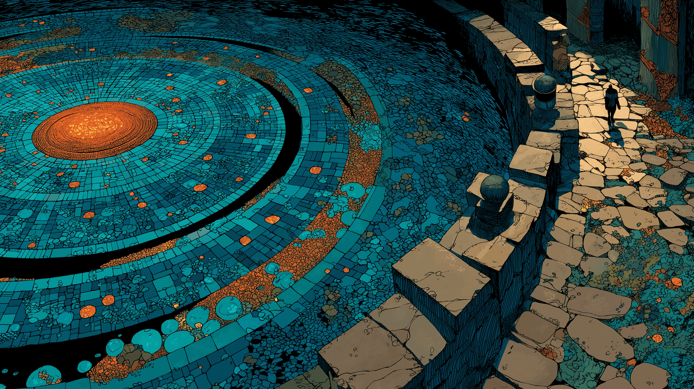

# Mosaic



Encrypted tile-based virtual partition manager for Linux and macOS.

Mosaic creates encrypted virtual partitions composed of fixed-size file fragments called **tiles** (default: 256 MB each). Vaults are mounted as FUSE filesystems, providing transparent encryption/decryption. The interface is a full-screen TUI built with ratatui.

## Concepts

- **Vault**: An encrypted container described by a `vault.header` file (10 MB, padded)
- **Tiles**: Binary pool files (`pool_000.bin`, `pool_001.bin`, ...) that store encrypted file data
- **Grout**: The header metadata binding tiles together (the "mortar" of the mosaic)

Files stored in a vault can span multiple tiles. Data is encrypted block-by-block (64 KB blocks) using ChaCha20-Poly1305 with deterministic nonces derived from pool ID and block index, enabling random-access reads without decrypting entire files.

## Prerequisites

**Linux:**
```sh
sudo apt install fuse3 libfuse3-dev pkg-config
```

**macOS:**
```sh
brew install macfuse
```

**Rust toolchain** (1.70+):
```sh
curl --proto '=https' --tlsv1.2 -sSf https://sh.rustup.rs | sh
```

## Installation

```sh
cargo install --path crates/mosaic-tui
```

Or build from source:
```sh
cargo build --release
# Binary at target/release/mosaic-tui
```

## Usage

### TUI mode (interactive)

```sh
mosaic-tui
```

Launches a full-screen terminal interface with three screens:
- **Unlock** - Enter vault path and password to mount
- **Init** - Create a new vault with configurable tile size
- **Dashboard** - View mounted vault status, tile usage, and file listing

### CLI mode

```sh
# Create a new vault
mosaic-tui init /path/to/vault.header

# Mount a vault
mosaic-tui mount /path/to/vault.header /mnt/my-vault

# Check vault status
mosaic-tui status /path/to/vault.header

# Unmount and lock
mosaic-tui seal /path/to/vault.header
```

## Architecture

```
mosaic/
  crates/
    mosaic-core/     Pure cryptographic and data logic
    mosaic-fuse/     FUSE filesystem implementation (fuser)
    mosaic-tui/      TUI binary (ratatui + crossterm + clap)
```

### mosaic-core

The foundation crate with no platform dependencies:

- **crypto.rs** - Argon2id key derivation, ChaCha20-Poly1305 encryption, HMAC-SHA256 integrity
- **header.rs** - Vault header format (10 MB padded, versioned binary format)
- **pool.rs** - Tile management with block-level encryption (64 KB blocks)
- **index.rs** - BTreeMap-based virtual file index supporting directories

### mosaic-fuse

FUSE filesystem exposing vault contents as a mounted directory. Supports:
- File read/write with on-the-fly encryption
- Directory listing, creation, removal
- Automatic header save on unmount

### mosaic-tui

Terminal UI and CLI binary. State machine with Unlock, Init, and Dashboard screens.
Custom `PoolBar` widget for tile usage visualization.

## Security

### Cryptographic choices

| Component | Algorithm | Purpose |
|-----------|-----------|---------|
| KDF | Argon2id (m=64MB, t=3, p=4) | Password-to-key derivation, memory-hard |
| Encryption | ChaCha20-Poly1305 | Authenticated encryption of header and pool data |
| Integrity | HMAC-SHA256 | Header tamper detection |
| Hashing | SHA-256 | Pool file checksums |

### Security properties

- All sensitive data (keys, passwords, decrypted headers) is **zeroized on drop**
- Password input is masked in TUI; `rpassword` used for CLI
- No temporary files - all operations are in-memory
- Pool encryption uses deterministic nonces derived from `(pool_id, block_index)` for random access
- Header format is versioned for future migration support
- Error messages never leak cryptographic details

### Vault format

```
vault.header (10 MB fixed):
  [0..128]     VaultPrelude (unencrypted: magic, version, Argon2 params, nonce)
  [128..136]   Encrypted data length (u64 LE)
  [136..N]     Encrypted VaultHeader (ChaCha20-Poly1305)
  [N..10MB-32] Zero padding
  [10MB-32..]  HMAC-SHA256 over bytes [0..10MB-32]
```

## Testing

```sh
cargo test
```

Tests cover:
- KDF determinism and password differentiation
- Encrypt/decrypt roundtrips
- HMAC tamper detection
- Header init, open, wrong-password rejection
- Pool allocation across tile boundaries
- File index CRUD and directory listing
- TUI state machine transitions

## License

MIT
